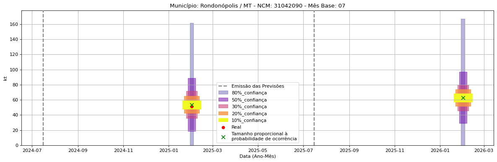

<header>
    <h1><a href="https://quantimportbrazil.github.io/Sobre/">QuantImport</a></h1>
</header>

---

# Previsão de Importação - Rondonópolis-MT

> **Emissão:** 06-2025
> Para fins de comparação, também apresentamos a seguir previsões e valores reais de períodos anteriores ao atual.
> As previsões foram geradas com base em dados limitados até o mês 6.

---

**[Home](https://quantimportbrazil.github.io/Sobre/)** | **[Selecionar Estado (UF)](https://quantimportbrazil.github.io/Unidades_Federativas/)**

Fator de Influência em Destaque:

Previsão Influenciada:
- Município: Rondonópolis
- Produto (NCM): Outros cloretos de potássio 
- Mês previsto: 11

Fator Influenciador:
- Município: Salvador
- Produto (SH2): Adubos (fertilizantes)
- Mês previsto: 11
- Unidade: kt_lag1

