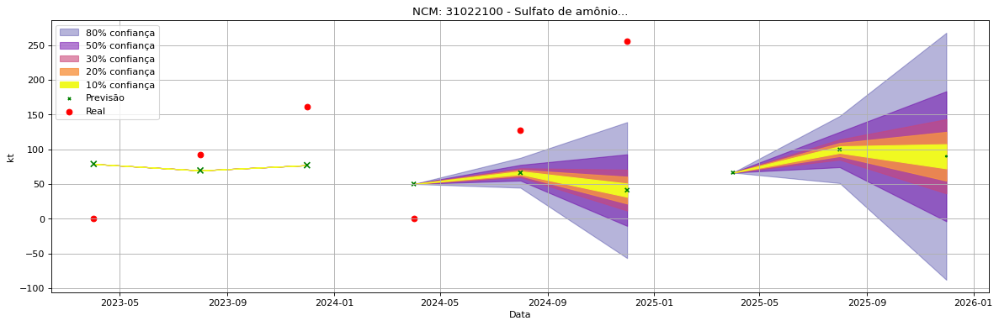

<header>
    <h1><a href="https://quantimportbrazil.github.io/Sobre/">QuantImport</a></h1>
</header>

---

# Previsão de Importação - Rondonópolis-MT

> **Emissão:** 06-2025
> Para fins de comparação, também apresentamos a seguir previsões e valores reais de períodos anteriores ao atual.
> As previsões foram geradas com base em dados limitados até o mês 6.

---

**[Home](https://quantimportbrazil.github.io/Sobre/)** | **[Selecionar Estado (UF)](https://quantimportbrazil.github.io/Unidades_Federativas/)**

Fator de Influência em Destaque:

Previsão Influenciada:
- Município: Rondonópolis
- Produto (NCM): Ureia, mesmo em solução aquosa, com teor de nitrogênio (azoto) superior a 45 %, em peso, calculado sobre o produto anidro no estado seco-31021010 
- Mês previsto: 05

Fator Influenciador:
   quant_expl mês_expl sh2_expl sh4_expl ncm_expl uf_expl regin_expl mun_expl  \
19   MOP_lag6       03     None     None     None    None       None     None   
19   MOP_lag6       03     None     None     None    None       None     None   
19   MOP_lag6       03     None     None     None    None       None     None   
19   MOP_lag6       03     None     None     None    None       None     None   
19   MOP_lag6       03     None     None     None    None       None     None   
19   MOP_lag6       03     None     None     None    None       None     None   
19   MOP_lag6       03     None     None     None    None       None     None   
19   MOP_lag6       03     None     None     None    None       None     None   

    importance mês_target mun_target ncm_target anos_expl marca  
19    0.000159         05    5107602   31021010         8   dif  
19    0.000159         05    5107602   31021010         8   dif  
19    0.000159         05    5107602   31021010         8   dif  
19    0.000159         05    5107602   31021010         8   dif  
19    0.000159         05    5107602   31021010         8   dif  
19    0.000159         05    5107602   31021010         8   dif  
19    0.000159         05    5107602   31021010         8   dif  
19    0.000159         05    5107602   31021010         8   dif  

Fator de Influência em Destaque:

Previsão Influenciada:
- Município: Rondonópolis
- Produto (NCM): Sulfato de amônio-31022100 
- Mês previsto: 03

Fator Influenciador:
   quant_expl mês_expl sh2_expl sh4_expl ncm_expl uf_expl regin_expl mun_expl  \
37  Urea_lag4       03     None     None     None    None       None     None   
37  Urea_lag4       03     None     None     None    None       None     None   
37  Urea_lag4       03     None     None     None    None       None     None   
37  Urea_lag4       03     None     None     None    None       None     None   
37  Urea_lag4       03     None     None     None    None       None     None   
37  Urea_lag4       03     None     None     None    None       None     None   
37  Urea_lag4       03     None     None     None    None       None     None   
37  Urea_lag4       03     None     None     None    None       None     None   

    importance mês_target mun_target ncm_target anos_expl  marca  
37    0.001468         03    5107602   31022100         8  igual  
37    0.001468         03    5107602   31022100         8  igual  
37    0.001468         03    5107602   31022100         8  igual  
37    0.001468         03    5107602   31022100         8  igual  
37    0.001468         03    5107602   31022100         8  igual  
37    0.001468         03    5107602   31022100         8  igual  
37    0.001468         03    5107602   31022100         8  igual  
37    0.001468         03    5107602   31022100         8  igual  

Fator de Influência em Destaque:

Previsão Influenciada:
- Município: Rondonópolis
- Produto (NCM): Outros cloretos de potássio-31042090 
- Mês previsto: 10

Fator Influenciador:
  quant_expl mês_expl sh2_expl sh4_expl ncm_expl uf_expl regin_expl mun_expl  \
7   DAP_lag5       02     None     None     None    None       None     None   
7   DAP_lag5       02     None     None     None    None       None     None   
7   DAP_lag5       02     None     None     None    None       None     None   
7   DAP_lag5       02     None     None     None    None       None     None   
7   DAP_lag5       02     None     None     None    None       None     None   
7   DAP_lag5       02     None     None     None    None       None     None   
7   DAP_lag5       02     None     None     None    None       None     None   
7   DAP_lag5       02     None     None     None    None       None     None   

   importance mês_target mun_target ncm_target anos_expl marca  
7    0.000116         10    5107602   31042090         8   dif  
7    0.000116         10    5107602   31042090         8   dif  
7    0.000116         10    5107602   31042090         8   dif  
7    0.000116         10    5107602   31042090         8   dif  
7    0.000116         10    5107602   31042090         8   dif  
7    0.000116         10    5107602   31042090         8   dif  
7    0.000116         10    5107602   31042090         8   dif  
7    0.000116         10    5107602   31042090         8   dif  

